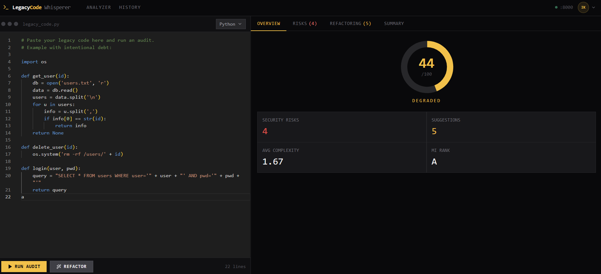

# LegacyCode Whisperer

AI-powered technical debt auditor. Paste legacy code, get instant maintainability scores, security risks, and AI-generated refactoring suggestions — with real-time streaming.

**Live:** https://legacy-code-whisperer.vercel.app

---

---

## Features

- **Maintainability score** — blends LLM reasoning (60%) with Radon static analysis (40%) into a 0–100 health score
- **Security audit** — identifies risks with severity levels (critical / high / medium / low)
- **Refactoring suggestions** — structured action plan with before/after code snippets
- **AI refactor** — full rewrite of the submitted code with a side-by-side diff view
- **Real-time streaming** — results stream token by token via SSE (no blank waiting screen)
- **17 languages** — Python, JavaScript, TypeScript, Java, Go, Rust, C, C++, C#, PHP, Ruby, Swift, Kotlin, Scala, R, SQL, Bash
- **Audit history** — per-user history stored in Supabase, protected by JWT auth
- **Auth** — Supabase email/password login, protected routes, session management

---

## Tech Stack

| Layer | Technology |
|---|---|
| Frontend | Next.js 14, Tailwind CSS, Lucide React, Monaco Editor, Framer Motion |
| Backend | FastAPI, Python 3.12, Uvicorn |
| AI | Llama 3.3 70B via Groq API (LangChain) |
| Static analysis | Radon (cyclomatic complexity + maintainability index) |
| Database & Auth | Supabase (PostgreSQL + Auth) |
| Deploy | Vercel (frontend) + Render (backend) |

---

## License

MIT — see [LICENSE](LICENSE).
